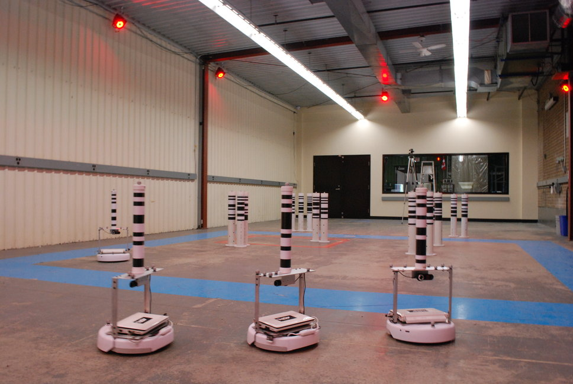
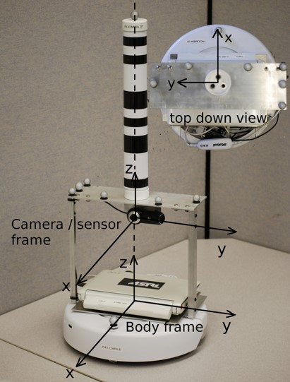
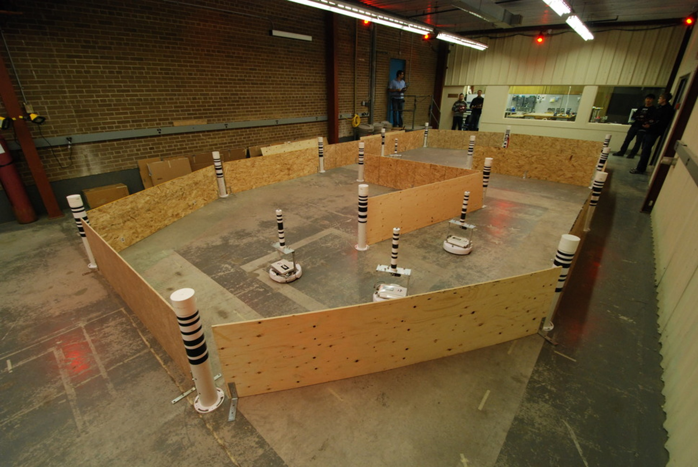

# Laboratory sessions manual for 11765_MUSI
This document describes how to set up the python environment required for the laboratory sessions, provides specific details about the dataset used and lists a series of learning resources.

## 1. Environment set up
Please follow the next steps in a linux environment using either a linux desktop version or a WSL from a Windows OS.

For setting WSL you will need to open the PowerShell and run the following commands

```bash
wsl --set-default-version 2
wsl --install -d Ubuntu-20.04
```

### 1.1 New environment
Follow this section only in case of setting the the python environment in a new computer.

#### 1.1.1 Clone the repository
First move to the directory were you want to build your environemnt, for instance in a /lib directory in your /home.

```bash
cd
mkdir lib
cd lib
```

Now clone the lab session contents from the remote repository.

git clone https://github.com/ericguerrero/11765_MUSI.git

#### 1.1.2 Set python environment
Go to the repository directory and execute next commands.
```bash
python3 -m venv env
source env/bin/activate
python3 -m pip install pip-tools
```

Now edit the 'pyproject.toml' to specify your python version preference, and build the 'requirements.lock' with the following lines.
```bash

pip-compile --output-file=requirements.lock pyproject.toml
python3 -m pip install -r requirements.lock
```

In case you need extra packages install them using the following command.

```bash
python3 -m pip install **name_of_a_packacge_you_need**
```

### 1.2 Update the repository
Folow this steps for each new lab session.
Go to your local repository directory, if it is located in a /lib directory on the /home use the following commands.

```bash
cd lib/11765_MUSI
```

Now commit your changes and syncronize with the remote repository on github in order to download the files for the new lab session. 

```bash
git add -A
git commit -m "add local changes"
git pull
```

Please notice that before being able to commit you will need to set up your git configuration as follows.
```bash
git config --global user.name "Mona Lisa"
git config --global user.email "email@example.com"
```
### 1.3 Open the jupyter notebook
Before launching the notebook to start with the new lab session you need to source your environment, use the following command.
```bash
source env/bin/activate
```
Now you can launch the jupyter notebook using next command.
```bash
jupyter notebook
```
Once inside jupyter notebook go to the notebooks directory using the menu at the left of the screen and open the desired laboratory notebook. Read carefully the statement and start filling the text and code blocks to solve the different tasks. 

------------------------------------
## 2. Dataset
The 2d indoor dataset collection consists of 9 individual datasets. Each dataset contains odometry and (range and bearing) measurement data from 5 robots, as well as accurate groundtruth data for all robot poses and (15) landmark positions. The dataset is intended for studying the problems of cooperative localization (with only a team robots), cooperative localization with a known map, and cooperative simultaneous localization and mapping (SLAM).




### 2.1 Data collection details
In each dataset, robots move to random waypoints in a 15m×8m indoor space while logging odometry data, and range-bearing observations to landmarks and other robots.


#### **Robots**
A fleet of 5 robots identical in construction and built from the iRobot Create (two-wheel differential drive) platform are used in producing the datasets. Each robot is equipped with a laptop computer and a monocular camera for sensing.



#### **Landmarks**
15 cylindrical tubes with the same dimensions are used as landmarks.

#### **Odometry**
Forward velocity (along the x-axis of the robot body frame) commands, v, and angular velocity commands (rotation about the z-axis of the robot body frame using right hand rule), ω, are logged at an average of 67Hz as odometry data.

#### **Measurements**
Each robot and landmark has a unique identification number encoded as a barcode (with known dimensions). Images captured by the camera on each robot (at a resolution of 960×720) are rectified and processed to detect the barcodes. The encoded identification number as well as the range and bearing to each barcode is then extracted. The camera on each robot is conveniently placed to align with the robot body frame.

#### **Occlusions**
In creating dataset 9, barriers were placed in the environment to occlude the robots' views. This reduced the number of measurements that the robots obtained. The robots also had to avoid these barriers while driving in the workspace. 



#### **Groundtruth**
A 10-camera Vicon motion capture system provides the groundtruth pose (x,y,θ) for each robot and groundtruth position (x,y) for each landmark at 100Hz with accuracy on the order of 1×10-3m. The reference frame used by Vicon serves also as the inertial reference frame in the datasets.

#### **Time Synchronization**
The Network Time Protocol (NTP) daemon is used to synchronize the clocks between the computers on each robot and the groundtruth data logging computer. Average timing error is on the order of 1×10-3s.


### 2.2 Files
Each dataset contains five files:
* **Odometry.dat**: Control data (translation and rotation velocity)
* **Measurement.dat**: Measurement data (range and bearing data for visually observed landmarks and other robots)
* **Groundtruth.dat**: Ground truth robot position (measured via Vicon motion capture – use for assessment only)
* **Landmark_Groundtruth.dat**: Ground truth landmark positions (measured via Vicon motion capture)
* **Barcodes.dat**: Associates the barcode IDs with landmark IDs.

The data is processed in the following way:
* Use all Odometry data
* Only use Measurement data for landmark 6 ~ 20 (1 ~ 5 are other robots)
* Use Groundtruth data to plot the robot state ground truth
* Use Landmark Groundtruth only for localization problem
* Associate Landmark Groundtruth with Barcodes to get landmark index from measurement
* Combine Odometry data with Measurement data ans sort by timestamp as input data

------------------------------------
## 3. Resources
This section provides a series of resources to ease your work programming on Python using a Jupyter notebook with the Pandas, Seaborn and Plotly libraries.

### 3.1 Jupyter notebook
User guide:
https://www.dataquest.io/blog/jupyter-notebook-tutorial/

### 3.2 Pandas
User guide:
https://pandas.pydata.org/docs/user_guide/index.html

Time Series:
https://www.dataquest.io/blog/tutorial-time-series-analysis-with-pandas/

Apply() function:
https://www.dataquest.io/blog/tutorial-how-to-use-the-apply-method-in-pandas/

Video lessons:
https://www.gormanalysis.com/blog/python-pandas-for-your-grandpa-1-1-introduction/

### 3.3 Seaborn
User guide:
https://seaborn.pydata.org/tutorial.html

### 3.2 Plotly
User guide:
https://plotly.com/python/getting-started/


### 3.3 GIT
User guide: https://docs.github.com/en/get-started/using-git/about-git

Quick guide 1: https://www.freecodecamp.org/news/learn-the-basics-of-git-in-under-10-minutes-da548267cc91/

Quick guide 2: https://blog.reviewnb.com/github-jupyter-notebook/